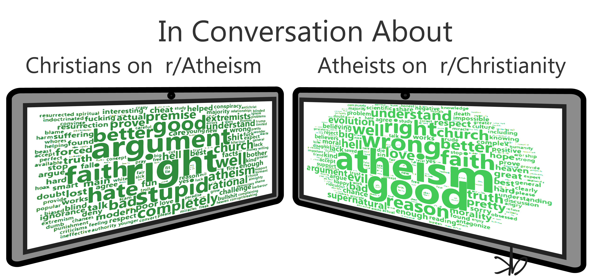

```{r setup, include=FALSE}
knitr::opts_chunk$set(echo = TRUE, warning = FALSE, message = FALSE)

library(tidyverse)
library(RedditExtractoR)
library(sentimentr)
library(tm)
library(knitr)
library(wordcloud2) 
library(webshot)
library(htmlwidgets)
```

## Introduction

<https://www.reddit.com/> provides a great opportunity to play around with text mining skills on any subject matter you find interesting. Subreddit topics range from politics to pictures of cats who look like they have jobs. 

To try out some text mining R packages, I pulled down comments from r/Christianity which has over 235,000 members at time of writing, <https://www.reddit.com/r/Christianity/>, and r/atheism which has over 2,600,000 members at time of writing, <https://www.reddit.com/r/atheism/>. I was interested in seeing how the sentiment of the text changed when those posting comments on the r/Christianity had discussions that involved the word "atheists" compared to when their discussions didn't involve the word "atheists". Additionally, I wanted to see the reverse for
those posting comments on r/atheism using the word "Christians".      

```{r DataPullSentiment, results='hide'}
##r/Christianity sentiment analysis 
#Pull down most recent 10 pages of post data from subreddit r/Christian. 
main <- get_reddit(subreddit = "Christianity",
                   search_terms ="atheists", 
                   page_threshold = 10, 
                   sort_by = "new") 

#Identify which comments include the word "atheists" 
main <- main %>% mutate(atheists = case_when(
              str_detect(main$comment, "atheists") == T ~ 1,
              str_detect(main$comment, "atheists") == F ~ 0
              ))

#Divide comments on the word "atheists" to two data frames
main_ath <- main %>% filter(atheists == 1)
main_no <- main %>% filter(atheists == 0)

#Run sentient analysis on both sets of data frames to compare.
sent_ath <- sentiment_by(main_ath$comment)
sent_no <- sentiment_by(main_no$comment)

#Build a table comparing the mean sentient for comments not mentioning "atheists" with those that do
mean_table <- sent_no %>% summarise("Without Atheists" = mean(ave_sentiment)) %>% 
  bind_cols(sent_ath %>% summarise("With Atheists" = mean(ave_sentiment))) 


##r/Atheism sentiment analysis 
#Pull down most recent 10 pages of post data from subreddit r/Atheism. 
main2 <- get_reddit(subreddit = "atheism",
                   search_terms ="Christians", 
                   page_threshold = 10, 
                   sort_by = "new") 

#Identify which comments include the word "Christians" 
main2 <- main2 %>% mutate(christians = case_when(
  str_detect(main2$comment, "christians") == T ~ 1,
  str_detect(main2$comment, "christians") == F ~ 0
))

#Divide comments on the word "Christians" to two data frames
main2_chr <- main2 %>% filter(christians == 1)
main2_no <- main2 %>% filter(christians == 0)

#Run sentient analysis on both sets of data frames to compare.
sent2_chr <- sentiment_by(main2_chr$comment)
sent2_no <- sentiment_by(main2_no$comment)

#Build a table comparing the mean sentient for comments not mentioning "Christians" with those that do
mean_table2 <- sent2_no %>% summarise("Without Christians" = mean(ave_sentiment)) %>% 
  bind_cols(sent2_chr %>% summarise("With Christians" = mean(ave_sentiment))) 


```

## Initial Reflections

At the time of analysis, the mean sentiment score of r/Christianity comments containing "Atheists" was lower (0.03) than comments that didn't contain "Atheists" (0.08). The results were similar for r/Atheism for comments containing "Christians" (-0.02) vs. those that did not (0.01). 

I pulled out the words that the sentiment analysis identified as positive or negative from the r/Christian comments that contained the word "Atheists" and from the r/Atheism comments that contained the word "Christians". To get a good visual representation of the emotionally charged language used by each group, I utilized the list to build two word clouds. 

```{r wordcloud, results='hide', fig.show = 'hide'}
#Extract terms found in sentient analysis in r/Christianity as positive or negative
terms_ath <- extract_sentiment_terms(main_ath$comment)

#Prepare corpus file for word cloud for posts with "atheists" 
corpus1 <- Corpus(VectorSource(c(unlist(terms_ath$positive), unlist(terms_ath$negative)))) 
corpus1[[1]][1]

##Text Cleaning for word cloud 1
#Convert text to lower case
corpus1 <- tm_map(corpus1, content_transformer(tolower))
#Remove numbers
corpus1 <- tm_map(corpus1, removeNumbers)
#Remove English common stopwords
corpus1 <- tm_map(corpus1, removeWords, stopwords("english"))
#Remove punctuations 
corpus1 <- tm_map(corpus1, removePunctuation)
#Eliminate extra white spaces
corpus1 <- tm_map(corpus1, stripWhitespace)
#Remove additional words
corpus1 <- tm_map(corpus1, removeWords, c("character", "like"))

#Create Term Document Matrix
tdm1 <- TermDocumentMatrix(corpus1)
m1 <- as.matrix(tdm1)
v1 <- sort(rowSums(m1),decreasing = T) 
d1 <- data.frame(word=names(v1), freq=v1)

#plot word cloud
ChristianWords <- wordcloud2(d1,
                             rotateRatio = 0,
                             size=0.85,
                             color = "#43CC58")

#export word cloud to be used in adobe file
saveWidget(ChristianWords,"tmp.html",selfcontained = F)

# and in png or pdf
webshot("tmp.html","ChristianWords.png", delay =5, vwidth = 863, vheight=464)

#Extract terms found in sentient analysis of r/Atheism as positive or negative
terms_chr <- extract_sentiment_terms(main2_chr$comment)

#Prepare corpus file for r/Atheism word cloud for posts with "Christians"
corpus2 <- Corpus(VectorSource(c(unlist(terms_chr$positive), unlist(terms_chr$negative)))) 
corpus2[[1]][1]

##Text Cleaning for word cloud 2
#Convert text to lower case
corpus2 <- tm_map(corpus2, content_transformer(tolower))
#Remove numbers
corpus2 <- tm_map(corpus2, removeNumbers)
#Remove English common stopwords
corpus2 <- tm_map(corpus2, removeWords, stopwords("english"))
#Remove punctuations 
corpus2 <- tm_map(corpus2, removePunctuation)
#Eliminate extra white spaces
corpus2 <- tm_map(corpus2, stripWhitespace)
#Remove additional words
corpus2 <- tm_map(corpus2, removeWords, c("character", "like"))

#Create Term Document Matrix
tdm2 <- TermDocumentMatrix(corpus2)
m2 <- as.matrix(tdm2)
v2 <- sort(rowSums(m2),decreasing = T) 
d2 <- data.frame(word=names(v2), freq=v2)

#plot word cloud
AtheistWords <- wordcloud2(d2,
                             rotateRatio = 0,
                             size=0.85,
                             color = "#2E8C3C")

#export word cloud to be used in adobe file
saveWidget(AtheistWords,"tmp.html",selfcontained = F)

# and in png or pdf
webshot("tmp.html","AtheistWords.png", delay =5, vwidth = 863, vheight=464)

```

After exporting both word clouds from a previous run, I pulled them into Adobe Illustrator and constructed one cohesive graphic. *Note: the words are slightly different in the below figure as the above code was rerun to knit the .Rmd after work was already completed on this picture.*  



## Final Considerations

This interesting initial dive into Redditt using some basic text mining packages in R leaves a number of avenues for additional follow-up. The first and most striking is that the sentiment analysis code marked "atheism" as a negative term. This could affect the average sentiment scores and be resolved by removing the word from the analysis and rerunning. However, the more interesting aspect is that the analysis program itself reflects a negative connotation around atheism that I had expected to find in the r/Christianity forum. 

Another avenue that would be very interesting to explore is how the sentiments may differ in other subreddits. I chose the largest two subreddits, but it may be that these tend to have more moderate discussions than some smaller ones such as r/Christians, r/Christian, r/ChristianMusic, r/TrueChristian, r/Reformed, r/FundieSnark, r/atheismrebooted, r/TrueAtheism, r/Atheists, r/atheistvids, r/AtheistHavens, and so forth. 

Of course, one of the negatives of such a high overview analysis is that it misses the intricacies of the statements made on each forum such as "Atheists have killed and persecuted just as many people as any religion" and "most christians do not understand science." A more in-depth  qualitative review of the data would be fascinating.